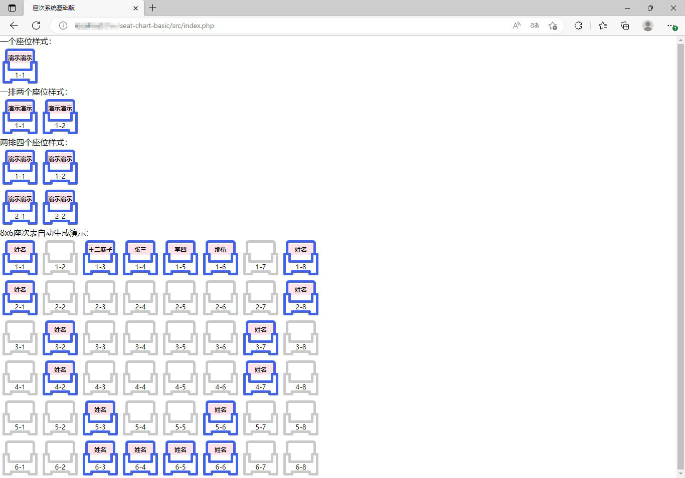
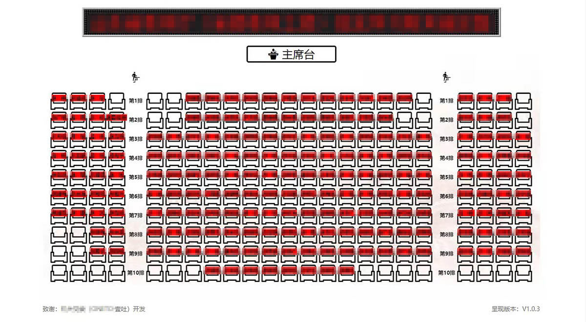

# 选座系统基础版

#### 介绍

百行代码构建一套选座系统雏形。

文档：[https://OpenWHY.github.io/seat-chart-basic/](https://OpenWHY.github.io/seat-chart-basic/)

#### 应用架构

传统 B/S 架构，使用 PHP 进行数据处理。

#### 演示

1.本源码运行界面

2.定制美化（仅供参考）

#### 使用教程

请自行架构PHP运行环境，下载代码后解压缩放入相应目录直接浏览即可。

Bibili：

#### 进阶功能

进阶功能仅提供可行性及功能参考，请自行开发定制；

**1.数据来源：** 使用第三方API或者本地表格导入数据替换本代码中PHP数组；

**2.界面美化：** 不过多介绍，添加头部、背景等美化页面风格；

**3.页面截图：** 设置一键保存图片功能，方便后期发送给参会人员；

**4.页面分享：** 设置一键分享功能，方便通过二维码、微信等形式分享；
 
**5.其他语言：** 可以根据自己熟悉的语言进行移植，逻辑简单都非常容易实现！

## 许可协议

[MIT](https://github.com/OpenWHY/seat-chart-basic/blob/main/LICENSE)